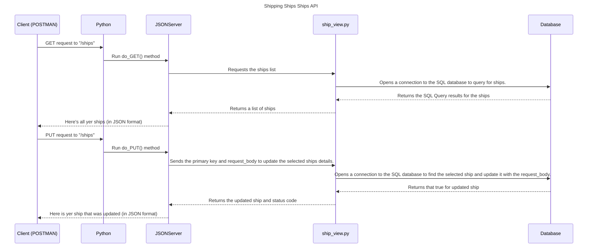

```mermaid
sequenceDiagram
    title Shipping Ships Ships API

    participant Client (POSTMAN)
    participant Python
    participant JSONServer
    participant ship_view.py
    participant Database
    
    Client (POSTMAN)->>Python:GET request to "/ships"
    Python->>JSONServer:Run do_GET() method
    JSONServer ->> ship_view.py: Requests the ships list
    ship_view.py ->> Database: Opens a connection to the SQL database to query for ships.
    Database -->> ship_view.py: Returns the SQL Query results for the ships
    ship_view.py -->>JSONServer: Returns a list of ships
    JSONServer-->>Client (POSTMAN): Here's all yer ships (in JSON format)
    Client (POSTMAN) ->> Python: PUT request to "/ships"
    Python ->> JSONServer: Run do_PUT() method
    JSONServer ->> ship_view.py: Sends the primary key and request_body to update the selected ships details.
    ship_view.py ->> Database: Opens a connection to the SQL database to find the selected ship and update it with the request_body.
    Database -->> ship_view.py: Returns that true for updated ship
    ship_view.py -->> JSONServer: Returns the updated ship and status code
    JSONServer -->> Client (POSTMAN): Here is yer ship that was updated (in JSON format)
    
```